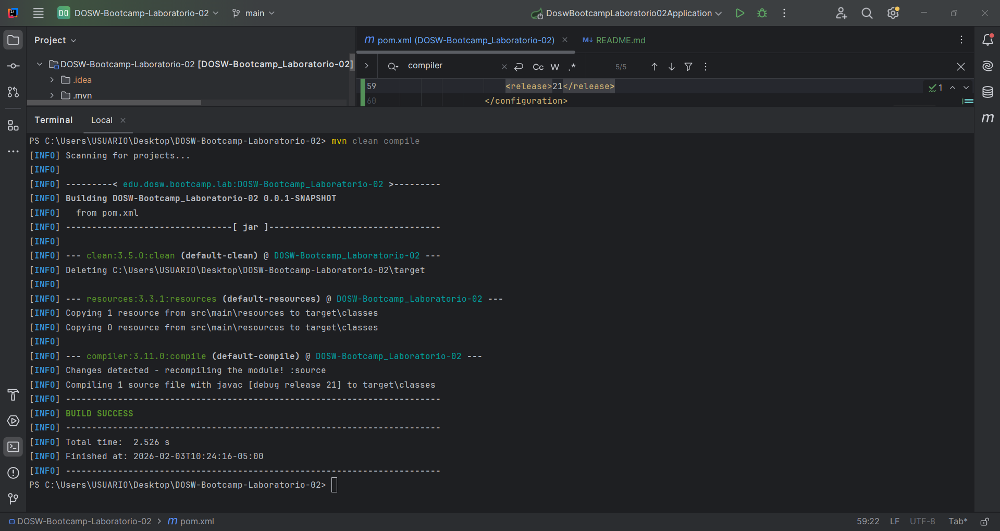
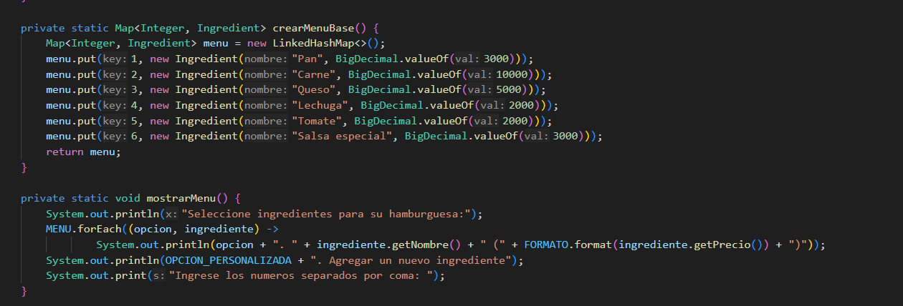
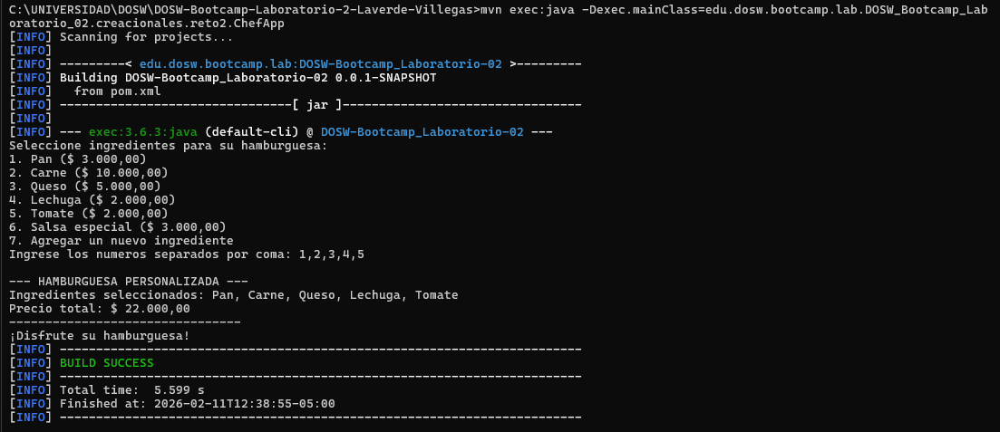
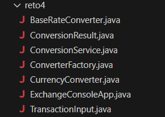
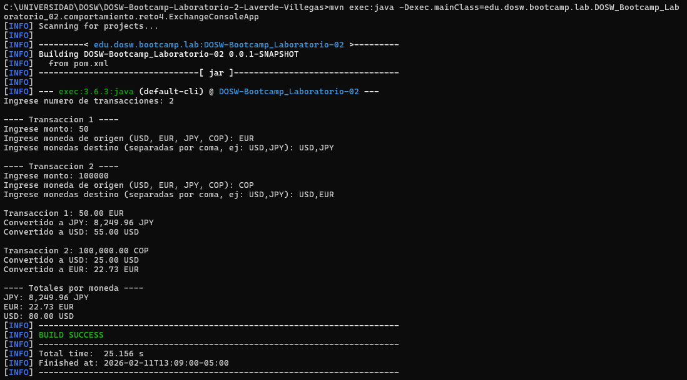
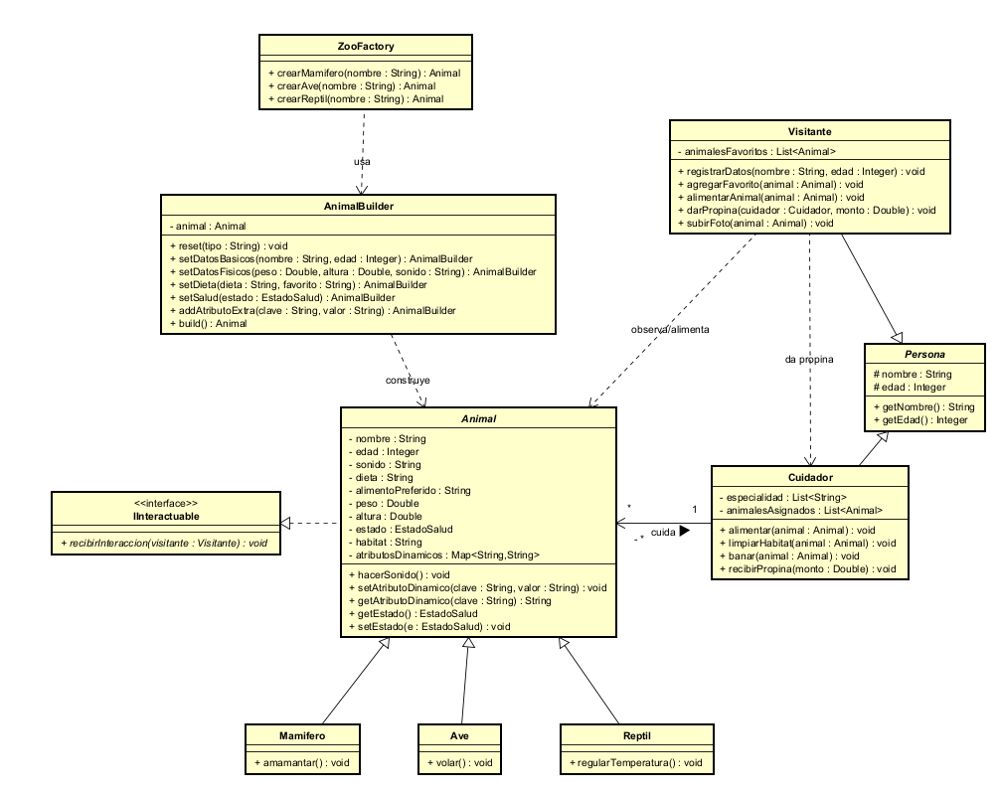

# LABORATORIO 2: SOLID - Patrones de Diseño - Diagramación UML Clases y POO Avanzada

---

### INTEGRANTES

- Juan Manuel Villegas Medina
- Juan José Laverde Ríos

---

#### Evidencias de compilación del proyecto:

- Compilación por 'mvn clean compile':

- Compilación por 'mvn exec:java -D"exec.mainClass=edu.dosw.bootcamp.lab.DOSW_Bootcamp_Laboratorio_02.DoswBootcampLaboratorio02Application"'

### RETO 1
Iniciamos este reto creando una nueva branch para trabajar separados del main 

Una vez tenemos nuestro espacio de trabajo configurado creamos dentro de la carpeta de comportamiento nuestro Reto 1 ya que usaremos este patron para darle solucion a nuestro problema C:\Users\josef\DOSW-Bootcamp-Laboratorio-2-Laverde-Villegas\src\main\java\edu\dosw\bootcamp\lab\DOSW_Bootcamp_Laboratorio_02\comportamiento 

Ahora hacemos esto asi ya que el patron de diseño Strategy lo usamos con el objetico de aplicar diferentyes estrategias de descuento segun el tipo de cliente. para esto pensamos una estuctura de clase de esta forma: 

producto representa el objeto con nombre y un precio, cartitem representa un producto con su cantidad dentro del carrito, discountstrategy es la interfaz que define el comportamiento de calculo de descuento, discountnuevo es la estrategia de descuento para nuevos clientes, dicountfrecuente es la estrategia de decuento para clientes frecuentes, carrito es donde gestionamos los productos y el subtotal mas los descuentos, receiptgenerator es donde se genera el recibo de lo comprado, y el Maindemo es donde ejecutamos o sea la clase principal del reto1

Ahora para los principios SOLID los dividimos de esta forma para la funcionalidad de nuestro reto:

#### Principio de Responsabilidad Unica

En el Reto 1 aplicamos el principio de responsabilidad única separando claramente las funciones de cada clase. Por ejemplo, la clase Producto solo representa la información de un producto, Carrito se encarga de gestionar los productos y calcular los valores de la compra, las clases de descuento en discountNuevo y DiscountFrecuente solo calculan el descuento, y ReceiptGenerator se encarga de generar el recibo De esta forma cada clase tiene un propósito específico y no mezcla varias responsabilidades

#### Principio Abierto/Cerrado 

Aplicamos el principio abierto/cerrado al diseñar el sistema de descuentos mediante la interfaz DiscountStrategy Gracias a esto, si en el futuro queremos agregar un nuevo tipo de descuento no es necesario modificar la clase Carrito, sino simplemente crear una nueva clase que implemente la interfaz el sistema puede extenderse sin alterar el código existente lo que hace la solución más flexible y fácil de mantener

#### Principio de Sustitución de Liskov

El principio de sustitución de Liskov se cumple porque las clases DiscountNuevo y DiscountFrecuente pueden usarse en lugar de DiscountStrategy sin afectar el funcionamiento del programa En el carrito no importa qué tipo de descuento se esté utilizando ya que todas las estrategias cumplen el mismo contrato definido por la interfaz Esto permite cambiar el comportamiento del descuento sin romper la lógica del sistema

#### Principio de Segregación de Interfaces

En nuestra solución aplicamos el principio de segregación de interfaces al definir una interfaz DiscountStrategy sencilla que contiene únicamente el método necesario para calcular el descuento De esta manera las clases que implementan la interfaz no se ven obligadas a depender de métodos que no necesitan lo que mantiene las interfaces simples, claras y enfocadas en una sola funcionalidad

#### Principio de Inversión de Dependencias

Aplicamos el principio de inversión de dependencias haciendo que la clase Carrito dependa de la abstracción DiscountStrategy y no de las implementaciones concretas de los descuentos. Esto permite cambiar fácilmente la estrategia de descuento sin modificar el código del carrito Gracias a esto el sistema queda menos acoplado y más preparado para futuros cambios o extensiones

Ahora despues de lo explicada ejecutamos nuestro main y nos da como restado esto en nuestra terminal:

Lo que nos indica que nuestro codigo funciona ya que se aplican los descuentos y los productos de acuerdo a como se propone en el reto

En visual nos queda una estructura de esta forma 

Ahora con respecto al polimorfismo se aplica dentrro de la clase de la interfaz de DiscountStrategy, la clase de carrito trabaja con la abstraccion discountstrategy pero cuando se ejecuta se pueden usar diferentes implementaciones siendo discountnuevo o discountfrecuente

Ambos objetos son tratados como discountstrategy pero ejecutan comportamientos diferentes segun el cliente ya que pues hay 2 tipos diferentes de descuento, esto permite que un mismo metodo tenga multiples comportamientos dependiendo de la estrategia utilizada

#### RETO 2

- Categoría del patrón de diseño: Creacional
- Patrón utilizado: Builder
- Detalle de la solución: El chef virtual arma la hamburguesa por etapas, según los ingredientes que el usuario va eligiendo. ChefApp muestra el menú base, permite ingresar ingredientes personalizados y entrega la selección a BurgerChef, que orquesta el proceso con CustomBurgerBuilder para ir agregando cada ingrediente en orden. Burger encapsula el resultado final y calcula el precio total con streams, sumando los valores de cada ingrediente.

- Por qué Builder: La combinación de ingredientes es abierta y puede crecer; separar el armado de la instancia final evita constructores gigantes y mantiene el código preparado para nuevas opciones sin romper lo existente.
- Cómo se ve en ejecución: El flujo en consola guía al usuario, lista la hamburguesa completa con los ingredientes seleccionados y muestra el total formateado. Si el usuario no elige nada, se informa que no hay ingredientes; si agrega un ingrediente propio, se integra al cálculo igual que los predefinidos.

#### RETO 3

En el reto 3 desarrollamos una solucion aplicando el patron Factory Method para centralizar la creacion de distintos tipos de vehiculos La idea principal fue evitar condicionales repetidos en la aplicacion principal y delegar toda la logica de creacion a una unica clase responsable de fabricar los objetos Esto nos permitio tener un codigo mas limpio escalable y facil de mantener especialmente cuando se agregan nuevos tipos categorias o modelos de vehiculos

La estrategia consistio en definir una clase base Vehicle que representa el concepto general de un vehiculo y a partir de ella crear clases concretas como Car Bicycle Motorcycle Boat Airplane Avioneta Helicopter y JetSki Cada una hereda de Vehicle y representa una implementacion especifica Luego creamos enums como VehicleType Category y Model para estandarizar las opciones que el usuario puede elegir y reducir errores al momento de crear los objetos

El nucleo del patron se implemento en la clase VehicleFactory donde a partir del tipo categoria y modelo seleccionados se devuelve la instancia correcta del vehiculo con sus atributos ya configurados como precio velocidad y equipamiento De esta forma la clase ApplicationReto3 solo se encarga de interactuar con el usuario leer las opciones y utilizar la fabrica sin conocer los detalles internos de como se construye cada vehiculo Esto cumple con el principio de responsabilidad unica y separa claramente la logica de negocio de la logica de creacion de objetos

Finalmente validamos la solucion ejecutando la aplicacion desde el main comprobando que se pudieran crear multiples vehiculos agregarlos a una lista y calcular correctamente los totales Con esto logramos una implementacion coherente del patron creacional solicitada bien organizada dentro del paquete creacionales reto3 y lista para integrarse al proyecto principal sin afectar el trabajo de otros retos

#### RETO 4

- Categoría del patrón de diseño: Creacional
- Patrón utilizado: Factory Method
- Detalle de la solución: Cada transacción puede venir en una moneda distinta, así que la creación del convertidor depende de la moneda origen. ConverterFactory devuelve el CurrencyConverter apropiado (actualmente BaseRateConverter con tasas reales expresadas en USD por unidad). ConversionService toma la lista de destinos, delega la conversión al convertidor y agrega los resultados por moneda con streams para entregar totales consolidados.
- Por qué Factory Method: Evita condicionales repetidos para elegir convertidor, facilita agregar nuevas fuentes de tasas o proveedores sin tocar el flujo de entrada y salida, y mantiene la lógica de captura separada de la lógica de creación.
- Cómo se ve en ejecución: ExchangeConsoleApp pide cuántas transacciones se quieren convertir, solicita monto, moneda de origen y destinos separados por coma, muestra cada conversión y al final presenta un resumen de totales por moneda. El formato numérico se deja listo para lectura en consola y los errores de entrada (monto o moneda inválida) se controlan pidiendo reintento.

#### Reto 5: El Café Personalizado

para este reto el tipo de patron que usamos fue el de Patrones Estructurales Decorator 

Para este reto decidimos usar el patrón Decorator porque necesitábamos una forma de agregar toppings a un café base sin tener que crear una clase diferente para cada combinación posible de ingredientes si tuviéramos que crear clases como CafeConLecheYChocolate o CafeConCarameloYMentaYCremaBatida sería un desastre y terminaríamos con cientos de clases que básicamente hacen lo mismo pero con diferentes combinaciones

El patrón Decorator nos permite ir envolviendo el café base con capas de toppings de forma dinámica, entonces podemos crear cualquier combinación que el cliente quiera sin modificar el código existente. Además cumple perfectamente con el principio Open/Closed de SOLID porque podemos agregar nuevos toppings simplemente creando nuevas clases decoradoras sin tocar las que ya existen.

Cómo lo aplicamos?

Lo primero que hicimos fue crear una interfaz Cafe que define los métodos básicos que cualquier café debe tener, que son getDescripcion para saber qué ingredientes tiene y getPrecio para calcular cuánto cuesta. Luego creamos la clase CafeBase que es nuestro café simple sin nada agregado, este tiene un precio base de tres mil pesos y su descripción es simplemente Café base.

Después creamos la clase abstracta ToppingDecorator que implementa la interfaz Cafe y tiene una referencia a otro objeto Cafe. Esta clase es la clave del patrón porque permite que los decoradores se envuelvan unos a otros como si fueran capas de una cebolla. Cada decorador concreto como Leche o Chocolate o Caramelo extiende esta clase abstracta y en sus métodos llama primero al café que está decorando y luego agrega su propia información.

Por ejemplo cuando creamos un café con leche y chocolate, lo que pasa internamente es que primero tenemos el CafeBase, luego lo envolvemos con Leche que agrega mil pesos y concatena más Leche a la descripción, y después envolvemos todo eso con Chocolate que suma mil quinientos pesos más y agrega más Chocolate a la descripción. Así cuando llamamos a getPrecio nos da el total sumando todo en cadena y cuando llamamos a getDescripcion obtenemos la lista completa de ingredientes.

También agregamos la funcionalidad de toppings personalizados con la clase ToppingPersonalizado que permite al usuario inventar su propio topping con el nombre y precio que quiera. Esto hace el sistema super flexible porque no estamos limitados solo a los toppings predefinidos.

En la clase principal Reto5CafePersonalizado manejamos la interacción con el usuario mostrando un menú de toppings disponibles y permitiendo que seleccione varios a la vez separados por comas. Guardamos todos los cafés creados en una lista y al final usamos streams de Java para calcular el precio total sumando los precios de todos los cafés con mapToDouble y sum. También mostramos un resumen bonito de cada café con sus ingredientes y precio individual.

El patrón Decorator nos dio exactamente lo que necesitábamos, una forma elegante de componer objetos dinámicamente agregando responsabilidades sin crear explosión de clases y manteniendo el código limpio y fácil de extender.

### Reto 8

### Diseño de la Solución y Principios SOLID

Para el diseño de la arquitectura del ECI Zoo, se optó por una estructura orientada a objetos que prioriza la mantenibilidad y la escalabilidad, aplicando los siguientes principios:

Principio de Responsabilidad Única (SRP): Se definieron responsabilidades claras para cada entidad con el fin de evitar clases saturadas de lógica. La clase Animal se encarga estrictamente de los datos biológicos y el estado de salud, mientras que las acciones de mantenimiento y la experiencia del usuario se delegan a las clases Cuidador y Visitante, respectivamente. La lógica de creación se aisló completamente en clases de fabricación especializadas.

Principio de Abierto/Cerrado (OCP): La arquitectura permite la extensión sin necesidad de modificar el código fuente existente. Para los atributos dinámicos requeridos (color, historial, rareza), se implementó una estructura de datos flexible en la clase base que permite agregar nuevas características en tiempo de ejecución. Asimismo, el uso de una clase abstracta para los animales permite integrar nuevas especies simplemente extendiendo la jerarquía.

Principio de Sustitución de Liskov (LSP): El diseño asegura que las subclases como Mamifero, Ave o Reptil puedan ser utilizadas indistintamente allí donde se requiera un objeto de tipo Animal. Esto garantiza que el sistema de gestión pueda procesar cualquier especie sin conocer sus detalles internos, manteniendo la integridad del programa.

Principio de Inversión de Dependencias (DIP): Las interacciones entre los actores y los animales se realizan a través de abstracciones e interfaces. El Visitante y el Cuidador no dependen de tipos concretos de animales, sino de la definición general de Animal y la interfaz IInteractuable, lo que reduce el acoplamiento y facilita cambios futuros.

### Patrones de Diseño Implementados

Para resolver los retos de creación y configuración de los objetos dentro del zoológico, se aplicaron dos patrones fundamentales:

Factory Method: Se centralizó la lógica de instanciación en la clase ZooFactory. Este patrón permite que el resto del sistema solicite la creación de animales sin preocuparse por la lógica interna de inicialización de cada especie, encapsulando el uso de constructores y permitiendo un control total sobre el inventario del zoológico.

Builder: Debido a la gran cantidad de atributos que posee un Animal (datos físicos, dieta, estado de salud y atributos dinámicos), se implementó el patrón Builder. Esto permite construir los objetos paso a paso, mejorando significativamente la legibilidad del código y evitando errores comunes al configurar múltiples parámetros opcionales o complejos.

Estructura de Clases y Relaciones

Herencia en Actores: Se implementó una clase abstracta Persona para agrupar los atributos de nombre y edad, heredados tanto por Cuidador como por Visitante. Esto optimiza el código y permite una gestión uniforme de los usuarios del sistema.

Asociaciones: El diagrama refleja una asociación directa entre el Cuidador y los animales asignados para su mantenimiento, así como las relaciones de interacción del Visitante, quien puede registrar sus favoritos, realizar donaciones o registrar material fotográfico, todo de manera desacoplada.

- Diagrama de clases 

### Preguntas inciales
 
- 1)¿Qué ventaja ofrece el polimorfismo en el diseño de clases frente al uso de múltiples condicionales para determinar el comportamiento de un objeto?
 
### Respuesta:
 
 - La principal ventaja es que el código se vuelve mucho más claro y fácil de mantener. En lugar de estar llenando las clases de if o switch para decidir qué hacer según el tipo de objeto, dejamos que cada objeto se comporte como le corresponde. Nosotros simplemente llamamos al método y listo. Eso hace que el sistema sea más ordenado, más fácil de extender y menos propenso a errores cuando en el futuro tengamos que agregar nuevos comportamientos, como se plantea en el laborator
 
 - 2)¿Por qué una clase inmutable puede mejorar la seguridad?
 
### Respuesta:
 
 - Porque una clase inmutable no cambia una vez creada, y eso nos da mucha tranquilidad. Sabemos que sus datos no van a ser modificados por accidente ni por otro hilo del programa. Eso reduce errores difíciles de detectar y evita comportamientos inesperados. Además, cuando compartimos ese objeto entre varias partes del sistema, no tenemos que preocuparnos de que alguien lo modifique y afecte a los demás.
 
 - 3)Según el principio de Abierto/Cerrado, ¿cómo deberíamos modificar el sistema si queremos añadir una nueva funcionalidad sin alterar el código existente?
 
### Respuesta:
 
 - La idea es no tocar lo que ya funciona. En lugar de modificar clases existentes, lo que hacemos es crear nuevas clases que se adapten a la estructura que ya está definida, por ejemplo implementando una interfaz o extendiendo una clase abstracta. Así el sistema crece sin romper nada, aprovechando lo que ya está probado y evitando introducir errores innecesarios.
 
 - 4)¿Qué es y por qué usamos el pom.xml?
 
### Respuesta:
 
 - El pom.xml es básicamente el corazón del proyecto cuando usamos Maven. Ahí está toda la información importante: qué dependencias usamos, cómo se compila el proyecto y qué versiones estamos manejando. Lo usamos porque nos ahorra muchísimo trabajo, ya que Maven se encarga de descargar librerías, compilar, ejecutar pruebas y empaquetar el proyecto de forma automática y ordenada, tal como se trabaja en el laboratorio.
 
 - 5)¿Qué diferencia hay entre mvn compile, mvn package y mvn install?
 
### Respuesta:
 
 - mvn compile solo se encarga de compilar el código para verificar que todo esté bien escrito. mvn package va un paso más allá y, además de compilar, genera el archivo final del proyecto, como un .jar. Y mvn install hace todo eso pero además guarda ese resultado en el repositorio local de Maven, lo que permite que otros proyectos nuestros puedan usarlo sin problema.
 
 - 6)¿Qué diferencia existe entre una interfaz y una clase abstracta?
 
### Respuesta:
 
 - La diferencia está en el nivel de responsabilidad que tienen. Una interfaz define qué debe hacer una clase, pero no cómo hacerlo, es más un contrato. En cambio, una clase abstracta ya puede tener parte del comportamiento definido y compartir atributos o métodos entre sus subclases. Nosotros usamos interfaces cuando queremos flexibilidad y clases abstractas cuando hay lógica común que vale la pena reutilizar.

